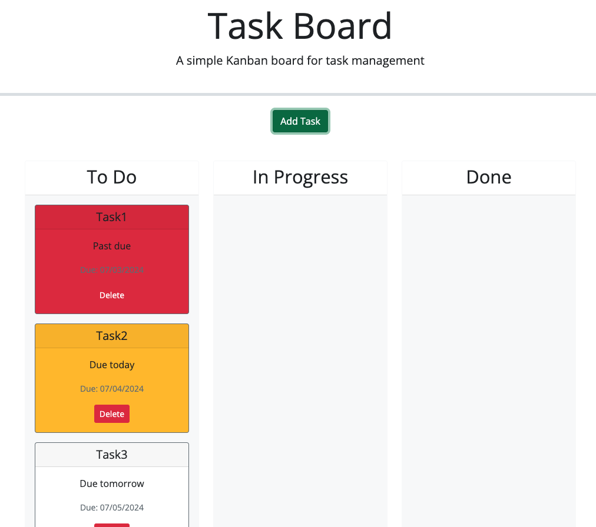

# Task Board

## Overview

The Task Board Project is a web application designed to help project team members organize, manage, and track their tasks efficiently. The application provides a visual task board where tasks can be added, categorized, and tracked based on their progress states.

  ## Table of Contents
  - [Overview](#overview)
  - [Key Features](#key-features)
  - [Usage](#usage)
  - [Installation](#installation)
  - [License](#license)
  - [Questions](#questions)

## Key Features

1. Task Organization: Tasks are displayed in columns based on their progress state (Not Yet Started, In Progress, Completed).
2. Color Coding: Tasks are color-coded to indicate their urgency, with yellow for tasks nearing their deadline and red for overdue tasks.
3. Add New Tasks: Users can easily add new tasks using a modal dialog where they can input the task title, description, and deadline.
4. Drag-and-Drop Interface: Tasks can be dragged and dropped between columns to update their progress state, providing a flexible and intuitive way to manage tasks.
5. Persistent Storage: Tasks are saved in the browser’s localStorage, ensuring that task data persists even after the page is refreshed.
6. Task Deletion: Users can delete tasks, and deleted tasks will not reappear after a page refresh.

## Usage

1. Viewing Tasks
   - Upon opening the task board, you will see tasks organized in columns based on their progress state.
2. Adding a Task
   - Click the “Add Task” button.
   - Fill out the title, description, and deadline date in the modal dialog.
   - Click “Save” to add the task to the board.
3. Managing Task Progress
   - Drag tasks between columns to update their state (Not Yet Started, In Progress, Completed).
4. Deleting a Task
   - Click the delete button on a task card to remove it from the board.

## Installation

**Clone the Repository**
```
git clone https://github.com/yourusername/task-board.git
```

## License 

This project is licensed under the [MIT](https://opensource.org/licenses/MIT) license

## Mock-Up



